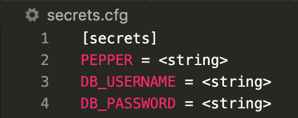

# Sling Messaging

### Introduction

Sling Messaging is a Single Page React Application that allows users to send and read real-time chat messages from multiple channels. Users are required to authenticate using an email and password - their email, username or password can be updated later in the application. Messages are organised into channels with all users having access to all channels on the server. Sling supports replies to messages and parses any image URL that is sent as a message before displaying. Any user is able to create a channel, and delete channels that they have created. I hope you enjoy chatting away!!

P.S. The visual design of this application was inspired by Slack :)

### Usage

- Clone the repository from: https://github.com/hegdetejas/sling.git
- cd into the final/ folder
- Create a virtual environment to handle dependencies with: python -m venv env
- Install the dependencies via: pip3 install -r requirements.txt
- Create a secrets.cfg file with the following structure (it is important that this structure is maintained and the variables are named the same)
  - 
- Create the Sling database structure by running each of the files in the migration/ folder in chronological order according to the ISO-8601 timestamps
- Run the Flask application with the command: python app.py
- Chat away and enjoy!
